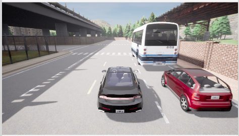
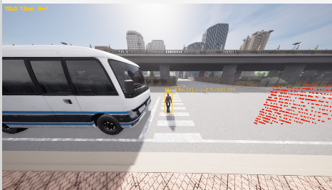

# Cooperative V2X-based AEB for Occluded Vulnerable Road Users — A CARLA / ROS 2 / ns-3 Co-Simulation Platform

  <p align="center">
    
    
  </p>


This repository hosts an open co-simulation platform for studying **cooperative V2X-assisted Autonomous Emergency Braking (AEB)** in scenarios where a pedestrian is **visually occluded** by a parked vehicle at an urban crossing. It combines CARLA 0.9.16 for high-fidelity 3D perception, ROS 2 Humble for the on-board AEB stack, and ns-3 instance running an IEEE 802.11p channel for the V2X communication— all orchestrated from standardized **OpenSCENARIO 2.0 (OSC2)** scenario files via a custom execution engine. The platform reproduces a controlled Euro-NCAP-style benchmark in which a perception-based AEB and a V2X-aware AEB face the *same* occluded-pedestrian event, and it supports parametric sweeps over ego speed, trigger distance, and wireless-channel perturbations (packet loss, latency, burst loss, position noise, reduced CAM rate) for systematic safety analysis.

## What This Does

The platform runs a **controlled comparison** on the same occluded-VRU event: a pedestrian steps off the curb from behind a stopped bus while the ego vehicle approaches a marked crossing. Each cell of the experiment is executed under matched seeds and a shared pedestrian trajectory, once per AEB stack, so any difference in outcome is attributable to perception — not to scenario variance.

- **Baseline AEB** — relies on the ego's own onboard sensors only. The bus physically occludes them, so the pedestrian is invisible until they step into line of sight. This arm isolates the worst-case onboard perception failure that V2X is meant to mitigate.
- **V2X-aware AEB** — brakes purely on Cooperative Awareness Messages (CAMs) broadcast by a roadside unit (RSU) at the crossing, which has an unobstructed view of the pedestrian. By construction, any positive outcome in this mode is attributable to V2X alone (the onboard sensors keep running, but only for parallel measurement — they do not actuate the brake).

On top of this comparison, the platform injects **wireless-channel perturbations** (Bernoulli packet drop, constant latency, burst loss, Gaussian position noise, reduced CAM rate) onto the ns-3 link, to characterize under which conditions cooperative perception still confers a safety benefit — and where it breaks down.

## Requirements

- CARLA 0.10.0 or 0.9.16, launched with `--ros2`
- ROS2 Humble
- Python 3.10
- `carla_msgs` (included in ros_workspace)
- **For V2X mode:** ns-3 with the `ns3-cosim` contrib module.
- **For the live dashboard:** [Foxglove Studio](https://foxglove.dev/) + the `foxglove_bridge` ROS 2 package (`sudo apt install ros-humble-foxglove-bridge`), plus Node.js + `npm` to build the custom panels under `dashboard/extensions/`. Import `dashboard/layouts/vru_demo.json` into Foxglove Studio to load the panel layout. Full setup in `dashboard/README.md`.

## Architecture

Both modes share the same simulator (CARLA, `--ros2`) and scenario engine (`osc2_engine`). They differ only in how the AEB receives pedestrian information.

**Baseline mode**

1. CARLA streams the ego's RGB camera and LiDAR over native ROS 2 topics.
2. `camera_lidar_perception` runs YOLOv8 on each RGB frame, takes depth for every person bbox from the closest credible LiDAR cluster whose pixels fall inside the bbox, and publishes tracked person detections on `/perception/detections`.
3. `carla_aeb_agent` consumes those detections, computes a per-tick time-to-collision in the ego corridor, and publishes a `CarlaEgoVehicleControl` back to CARLA on `/carla/actor<id>/vehicle_control_cmd`.
4. `osc2_engine` advances the world (`world.tick()`), drives the pedestrian and bus actors, and records per-tick + summary metrics.

**V2X mode** — everything above, plus:

5. `carla_v2x_bridge` spawns a static RSU pole at the stop sign and a second instance of `camera_lidar_perception` on its sensors (camera + LiDAR + YOLOv8), with an unobstructed view of the pedestrian.
6. The bridge forwards each RSU detection (in world frame) as an `ego_pose ped_pose` message over a TCP socket (`:8100`) to the ns-3 V2P gateway.
7. ns-3 simulates the IEEE 802.11p / 5.9 GHz channel and returns the most-recent CAM that was actually delivered to the ego.
8. `carla_aeb_v2x_agent` brakes **purely** on the incoming CAM (`/v2x/cam_received`) — `fusion_mode=v2x_only` is the default for `--v2x` runs (see `run_sweep.py:184`). The ego's own onboard perception keeps running and is logged on every tick, but it is not connected to the throttle/brake controller, so any positive outcome in this mode is attributable to V2X alone.

The baseline AEB talks directly to CARLA via native ROS 2 — no bridge in the loop. The V2X bridge exists only in V2X mode and acts as a thin adapter between CARLA's Python API and the ns-3 TCP socket.

## Project Structure

```
README.md                          # this file
osc2_engine/                       # OSC2 parser + CARLA executor (ROS-agnostic Python)
  grammar/                         #   Lark parser, IR dataclasses
  engine/                          #   Executor, action handlers, trigger evaluator
  carla_backend/                   #   CARLA connection, sensors
  metrics/                         #   Collector, calculators, CSV writer
  lib/carla.osc                    #   CARLA type extensions (blueprint, sensors)
  scenarios/                       #   .osc scenario files (VRU occlusion variants)
  tools/                           #   Helpers: chase relay, RSU visualizer, stop-sign finder
  carla_setup.py                   #   sys.path setup for the CARLA Python API
  run_scenario.py                  #   Single-scenario runner
  run_sweep.py                     #   Parametric speed × trigger sweep (baseline + V2X)
  run_sweep_MC.py                  #   Monte Carlo sweep, paired baseline/V2X
  run_sweep_MC_net.py              #   Monte Carlo + ns-3 channel perturbations
  v2x_net_middlebox.py             #   Middlebox that applies drop / delay / burst / noise / rate
ros_workspace/src/                 # ROS 2 packages
  carla_camera_lidar_perception/   #   YOLOv8 + LiDAR-depth fusion (used by ego AND RSU)
  carla_aeb_agent/                 #   Baseline AEB (consumes perception, brakes on TTC)
  carla_aeb_v2x_agent/             #   V2X-aware AEB (brakes purely on CAMs)
  carla_v2x_bridge/                #   CARLA ↔ ns-3 bridge + RSU spawner
  carla_vru_demo/                  #   Bringup / launch files
  carla_msgs/                      #   CARLA ROS 2 message types
dashboard/                         # Foxglove layout + custom panels (see dashboard/README.md)
docs/                              # Architecture diagrams + figures
output/                            # Simulation results (CSVs)
gateway-v2p-wifi.cc                # ns-3 V2P gateway source — see "Before You Begin"
```

## Before You Begin

Three one-time setup steps before the first run.

### 1. Build the ROS 2 workspace

From the repo root:

```bash
source /opt/ros/humble/setup.bash
cd ros_workspace
colcon build --symlink-install
```

### 2. Build the ns-3 V2P gateway

The `gateway-v2p-wifi.cc` file at the top of this repo is the V2P gateway source. Drop it into the `ns3-cosim` contrib module of an ns-3 checkout and build:

```bash
git clone https://github.com/usnistgov/ns3-cosim.git
cd ns3-cosim
cp /path/to/this-repo/gateway-v2p-wifi.cc examples/
```

Then follow the build instructions in the `ns3-cosim` repo to compile the example. `run_sweep.py --v2x` auto-launches the resulting binary; no manual start needed.

### 3. Download the YOLOv8 weights

The model weights are not shipped in this repo. Grab them once:

```bash
mkdir -p models
curl -L https://github.com/ultralytics/assets/releases/download/v8.3.0/yolov8m.pt \
     -o models/yolov8m.pt
```

### Note on CARLA 0.9.16

CARLA 0.9.16 has a known bug ([#9278](https://github.com/carla-simulator/carla/issues/9278)): `enable_for_ros()` creates topics with double slashes (`/carla//sensor/...`) which ROS 2 rejects. The scenarios in this repo work around it by setting `role_name="hero"` on the ego vehicle, which produces valid topics like `/carla/actor<id>/lidar/point_cloud`. No action needed — just a heads-up if you author your own `.osc`.

## Quick Start

You'll typically use three terminals: CARLA, the Foxglove bridge, and the sweep script.

### Terminal 1 — CARLA

```bash
cd /path/to/CARLA_0.9.16
./CarlaUE4.sh --ros2 -renderoffscreen
```

### Terminal 2 — Foxglove bridge

The bridge republishes ROS 2 topics over WebSocket so Foxglove Studio can connect:

```bash
source /opt/ros/humble/setup.bash
source ros_workspace/install/setup.bash
ros2 run foxglove_bridge foxglove_bridge --ros-args -p port:=8765

```

Then launch the Foxglove Studio desktop app, connect to `ws://localhost:8765`, and import `dashboard/layouts/vru_demo.json` (first time only — see `dashboard/README.md`).

### Terminal 3 — run a sweep

Source the ROS env first, then pick a runner:

```bash
source /opt/ros/humble/setup.bash
source ros_workspace/install/setup.bash
cd osc2_engine
```

| Script | Purpose | V2X flag |
|---|---|---|
| `run_sweep.py` | One run per cell (speed × trigger distance) | `--v2x` to enable V2X; omit for perception-only baseline |
| `run_sweep_MC.py` | Monte Carlo, many reps per cell | same `--v2x` switch |
| `run_sweep_MC_net.py` | Monte Carlo + ns-3 channel perturbations | **V2X-only — always run with `--v2x`** |

> **Recommended:** just run the script with no extra arguments. Every runner drops you into an **interactive prompt** that walks you through speed, trigger distance, seeds, and (for `run_sweep_MC_net.py`) which perturbations to apply, with sensible defaults — it's the most straightforward way to use the platform.

```bash
python3 run_sweep.py                # baseline perception
python3 run_sweep.py --v2x          # V2X
python3 run_sweep_MC.py --v2x       # Monte Carlo + V2X
python3 run_sweep_MC_net.py --v2x   # Monte Carlo + V2X + perturbations
```

Results land under `output/` — `sweep/`, `sweep_v2x/`, `sweep_MC/`, `sweep_MC_v2x/`, `sweep_MC_v2x_net/`.

### One-line examples (skipping the interactive prompt)

If you want to script a run instead of using the prompt, pass every parameter on the CLI:

```bash
# Baseline, one cell, demo mode (results discarded)
python3 run_sweep.py --speeds 40 --trigger-distances 35 --no-save \
    --carla-version 0.9.16 --view chase

# Baseline, full sweep
python3 run_sweep.py --speeds 30 35 40 45 50 55 --trigger-distances 15 25 35 \
    --carla-version 0.9.16

# V2X, full sweep
python3 run_sweep.py --v2x --speeds 30 35 40 45 50 55 --trigger-distances 15 25 35 \
    --carla-version 0.9.16

# Monte Carlo + V2X, 10 reps per cell
python3 run_sweep_MC.py --v2x --speeds 30 40 50 --trigger-distances 25 --reps 10 \
    --carla-version 0.9.16
```

## Metrics

Each scenario run emits two CSVs into the per-cell `output/…/<cell>/` directory; the sweep runner then aggregates them into one `summary.csv` per sweep.

### Per-tick CSV (`*_ticks_*.csv`)

| Field | Description |
|-------|-------------|
| `tick`, `timestamp` | Tick index and wall-clock seconds since scenario start |
| `ego_x`, `ego_y`, `ego_z`, `ego_yaw` | Ego pose |
| `ego_speed_ms`, `ego_speed_kmh` | Ego velocity |
| `ego_accel_ms2` | Smoothed longitudinal acceleration (0.1 s window) |
| `ego_jerk_ms3` | Rate of change of acceleration |
| `ped_x`, `ped_y`, `ped_z`, `ped_yaw` | Pedestrian pose |
| `ped_speed_ms` | Pedestrian speed |
| `distance` | Ego–ped Euclidean distance |
| `closing_speed_ms` | Rate of distance decrease |
| `ttc` | Per-tick time-to-collision |

### Per-scenario summary CSV (`*_summary_*.csv`)

One row per scenario run.

| Metric | Description |
|--------|-------------|
| `ttc_min_s` | Minimum TTC observed |
| `pet_s` | Post-Encroachment Time (ego vs. ped at the conflict zone) |
| `min_distance_m` | Closest ego–ped distance |
| `collision` | Boolean — physical contact registered |
| `collision_speed_kmh` | Ego speed at the moment of collision |
| `near_miss` | Boolean — AEB stopped, but at/past the ped's path |
| `near_miss_distance_m` | Distance at which the near-miss was logged |
| `path_blocking_m` | Signed distance from the ego front bumper to the ped clearance line at the ego's slowest moment (negative = blocking the crosswalk) |
| `lateral_clearance_min_m` | Closest lateral ego–ped distance |
| `max_decel_ms2` | Hardest braking observed |
| `max_jerk_ms3` | Maximum jerk |
| `speed_at_detection_kmh` | Ego speed when the AEB first brakes |
| `distance_at_detection_m` | Ego–ped distance when the AEB first brakes |
| `stopping_distance_m` | Distance from first brake to full stop |
| `brake_reaction_time_s` | Time from ped entering the lane to the first brake |
| `total_ticks`, `total_time_s` | Length of the run |

### Sweep summary (`summary.csv`)

The sweep runners (`run_sweep.py`, `run_sweep_MC.py`, `run_sweep_MC_net.py`) aggregate every per-scenario summary row into one `summary.csv` per sweep, with two extra columns:

- `target_speed_kmh`, `trigger_distance_m` — the sweep-cell parameters.
- `outcome` — a 3-tier classification derived from `collision` and `path_blocking_m`:
  - **SAFE** — AEB stopped the ego short of the pedestrian's path; the ped could walk in front of the ego.
  - **NEAR_MISS** — AEB triggered but the ego came to rest at/past the ped's path, blocking the crosswalk (ego must creep forward to clear).
  - **COLLISION** — physical contact.

## Design Notes

### Why OpenSCENARIO 2.0?

OSC2 is the ASAM standard for scenario description. Compared to writing scenarios as Python scripts against the CARLA API, OSC2 offers:

- **Readability** — a concise DSL instead of hundreds of API calls.
- **Reproducibility** — a standard format that decouples the *what* (the scenario) from the *how* (the simulator binding).
- **Parameterization** — declarative `keep()` constraints instead of hardcoded values, which makes parametric sweeps natural.

Scenarios for this platform live under `osc2_engine/scenarios/`; the engine parses any conforming `.osc` file, so adding a new occlusion / crossing variant is just a new file — no Python changes required.

### Why a custom execution engine?

No open-source OSC2 execution engine exists for CARLA 0.9.16 and up, so this repo ships its own: a Lark-based parser for a working subset of OSC2 (declarations, `keep()` constraints, `serial`/`parallel`/`one_of` composition, action handlers for `drive`/`walk`/`assign_position`, distance/elapsed triggers), backed by a CARLA executor that spawns actors, drives the world tick, manages NPC behavior, and emits metrics.

### CARLA version targeting

The repo targets **CARLA 0.10.0** (UE5) but also runs against **CARLA 0.9.16** (UE4) for hardware-constrained setups — select with `--carla-version 0.9.16` on every runner. The two versions differ mainly in engine and VRAM footprint (UE5 ≈ 16 GB, UE4 ≈ 8 GB); both expose native ROS 2 the same way, so the AEB stack is unchanged across versions. The sweeps currently published in this repo were run on 0.9.16.
