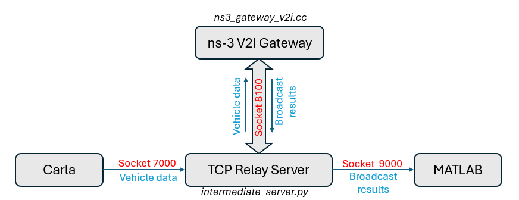

## 1. Software
  - MATLAB/Simulink Version: R2024b
  - OS: Ubuntu 22.04
  - ROS2 Distribution: Humble
  - NS3

## 2. Before You Begin
1. **CARLA:**
  - Install CARLA 0.9.15 (or later). Follow the [quick start installation](https://carla.readthedocs.io/en/latest/start_quickstart/) or build for [Linux](https://carla.readthedocs.io/en/latest/build_linux/).
  - Carla Client API for Python 3.10 is found [here](https://github.com/gezp/carla_ros/releases/).
    - Either copy both the `.egg` file and the `.whl` file to your `CARLA_ROOT/PythonAPI/carla/dist` directory *or* install the `.whl` file using `pip`.
  - Set the `CARLA_ROOT` environmental variable to your installation directory in `{.zshrc|.bashrc}`.
    ```sh
    export CARLA_ROOT=$HOME/Workspace/CARLA_0.9.15
    export PYTHONPATH=$PYTHONPATH:$CARLA_ROOT/PythonAPI/carla/dist/carla-<carla_version_and_arch>.egg:$CARLA_ROOT/PythonAPI/carla
    ```

2. **ROS2:**
  - [__ROS 2 Humble__](https://docs.ros.org/en/humble/Installation.html) — For Ubuntu 22.04 (Jammy)
  - Additional ROS packages may be required depending on your needs. [rviz2](https://github.com/ros2/rviz) is highly recommended to visualize ROS data.
  - Append the following to your `{.zshrc|.bashrc}`.
    ```sh
    source /opt/ros/humble/setup.{zsh|bash}
    ```
    
3. **Matlab/Simulink:**
  - Download and install Matlab 2024b from [MathWorks](https://www.mathworks.com/help/install/ug/install-products-with-internet-connection.html).
  
4. **NS3:**
  - Clone `ns3-cosim` repository:

   ```sh
   git clone https://github.com/usnistgov/ns3-cosim.git
   cd ns3-cosim
   ```
  - Copy ns3_gateway_v2i from this repo to examples/ folder in ns3-cosim repo
   ```sh
   cp /path/to/ns3_gateway_v2i.cc examples/
   ```
   
   Follow the build instructions provided in the `ns3-cosim` GitHub repository to compile this example.
    
## 3. Configuration
1. **Set up a project directory and clone the carla-ros-bridge repository:**
    ```sh
    mkdir -p ~/Workspace/carla-matlab-demo && cd ~/Workspace/carla-matlab-demo
    git clone -b carla_ros2_matlab_demo https://github.com/usnistgov/cav-cosim.git
    ``` 
2. **Set up ROS environment and install dependencies:**
    ```sh
    source /opt/ros/humble/setup.{zsh|bash}
    rosdep update
    rosdep install --from-paths src --ignore-src -r
    ```
3. **Build the ROS bridge workspace:**
    ```sh
    cd ~/Workspace/carla-matlab-demo/carla_ros_bridge
    colcon build --symlink-install
    ```
4. **Build NS3:**
    Please follow the instructions provided in the [ns3-cosim repository](https://github.com/usnistgov/ns3-cosim.git) and in the [`ns3-v2i` folder](./ns3-v2i) of this repository.

## 4. How to Run the Demo
You will require 5 Linux Terminals to run this demo:

1. **Terminal 01: Start CARLA Server**
    ```sh
    sh $CARLA_ROOT/CarlaUE4.sh -RenderOffScreen
    ```
2. **Terminal 03: Run inetermediate server**
   ```bash
   pyhton3 /path/to/intermediate_server.py
   ```
   
3. **Terminal 04: Run ns3**
   ```bash
   cd /path/to/ns3_cosim
   ./ns3 run "ns3_gateway_v2i --verbose"
   ```
	
4. **Terminal 05: Launch `carla_traffic_monitor` package**
   ```
   ros2 run carla_traffic_monitor traffic_light_monitor
   ```
5. **Terminal 06: Launch `carla_ad_demo` node**
    ```sh
    ros2 launch carla_ad_demo carla_matlab_demo_traffic_light.launch.py
    ```
6. **In matlab**
    - Run setup_carla_msgs_in_simulink.m
    - Open and run Traffic_Light_ROS2_NS3_demo.slx


