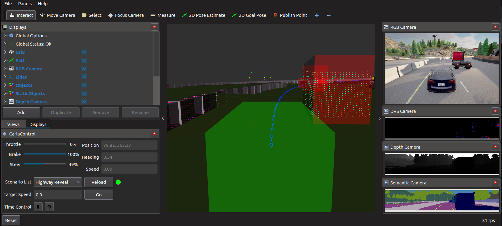

# Automatic Emergency Braking Feature Demo


## 1. Software and Data Description

- **Purpose and Maturity:**
  - This ROS package demonstrates an Automatic Emergency Braking (AEB) Feature as an adaptation of the [carla-simulator/ros-bridge](https://github.com/carla-simulator/ros-bridge) package.
  - It aims to analyze the behavioral competency of the AEB feature in an automated vehicle.
  - The package is designed to work with ROS2 Humble on Ubuntu 22.04 LTS and is restricted for demonstration purposes.

- **Repository Contents:**
  - Contains core ROS2 nodes, configuration files, and scripts needed to evaluate the AEB Feature.

- **Software and Dependencies:**
  - **Operating System:** Ubuntu 22.04 LTS
  - **Dependencies:**
    - **CARLA Version:** 0.9.15
    - **Scenario Runner Version:** 0.9.15
    - **ROS Version:** ROS2 Humble
  - **Python Version:** Testing was done using Python 3.10.
  - **Additional:** `.whl` and `.egg` files for Python 3.10 can be found [here](https://github.com/gezp/carla_ros/releases/).

## 2. Before You Begin
- **CARLA:**
  - Install CARLA 0.9.15 (or later). Follow the [quick start installation](https://carla.readthedocs.io/en/latest/start_quickstart/) or build for [Linux](https://carla.readthedocs.io/en/latest/build_linux/).
  - Carla Client API for Python 3.10 is found [here](https://github.com/gezp/carla_ros/releases/).
    - Either copy both the `.egg` file and the `.whl` file to your `CARLA_ROOT/PythonAPI/carla/dist` directory *or* install the `.whl` file using `pip`.
  - Set the `CARLA_ROOT` environmental variable to your installation directory in `{.zshrc|.bashrc}`.
    ```sh
    export CARLA_ROOT=$HOME/Workspace/CARLA_0.9.15
    export PYTHONPATH=$PYTHONPATH:$CARLA_ROOT/PythonAPI/carla/dist/carla-<carla_version_and_arch>.egg:$CARLA_ROOT/PythonAPI/carla
    ```

- **Scenario Runner:**
  - Install the matching Scenario Runner version (e.g., [v0.9.15](https://github.com/carla-simulator/scenario_runner/releases/tag/v0.9.15)) using the installation instructions found [here](https://carla-scenariorunner.readthedocs.io/en/latest/getting_scenariorunner/).
  - Set the `SCENARIO_RUNNER_ROOT` environmental variable to your installation directory in `{.zshrc|.bashrc}`.
    ```sh
    export SCENARIO_RUNNER_ROOT=$HOME/Workspace/scenario_runner
    ```

- **ROS2:**
  - [__ROS 2 Humble__](https://docs.ros.org/en/humble/Installation.html) — For Ubuntu 22.04 (Jammy)
  - Additional ROS packages may be required depending on your needs. [rviz2](https://github.com/ros2/rviz) is highly recommended to visualize ROS data.
  - Append the following to your `{.zshrc|.bashrc}`.
    ```sh
    source /opt/ros/humble/setup.{zsh|bash}
    ```

## 3. Configuration
1. **Set up a project directory and clone the carla-ros-bridge repository:**
    ```sh
    mkdir -p ~/Workspace/carla-ros-bridge && cd ~/Workspace/carla-ros-bridge
    git clone --recurse-submodules https://github.com/usnistgov/cav-cosim.git
    mv cav-cosim src
    ``` 
2. **Set up ROS environment and install dependencies:**
    ```sh
    source /opt/ros/humble/setup.{zsh|bash}
    rosdep update
    rosdep install --from-paths src --ignore-src -r
    ```
3. **Build the ROS bridge workspace:**
    ```sh
    colcon build --symlink-install
    ```
4. **Set up NS-3:**
    - Clone the feature/ROS2 branch of the UCEFwithNS3 repository:
      ```sh
      mkdir -p ~/Workspace/ns3 && cd ~/Workspace/ns3
      git clone -b feature/ROS2 --recurse-submodules https://github.com/tpr1/UCEFwithNS3.git
      ```
    - Install the ns-3 requirements:
      ```sh
      sudo apt install cmake
      sudo apt install build-essential
      sudo apt install libsqlite3-dev
      ```
    - Compile the ns-3 code from the UCEFwithNS3/av-ns3 directory:
      ```sh
      ./ns3 configure --enable-examples
      ./ns3 build
      ```

## 4. How to Run the Demo
You will require 3 Linux Terminals to run this demo:

1. **Terminal 01: Start CARLA Server**
    ```sh
    sh $CARLA_ROOT/CarlaUE4.sh -RenderOffScreen
    ```
2. **Terminal 02: Launch `carla_abf_demo` node with the desired ns-3 delay in ms (default = 0)**
    ```sh
    ros2 launch carla_abf_demo carla_abf_demo.launch.py ns3_delay:=5000
    ```
3. **Terminal 03: Run ns-3**
    ```sh
    cd ~/Workspace/ns3/UCEFwithNS3/av-ns3
    ./ns3 run automated-vehicles
    ```
    The ns-3 code must run after ns3_ros_bridge completes initialization. This is launched during the `carla_abf_demo` with other ROS2 nodes. Generally, it will be initialized by the time the rviz GUI loads.

4. **Using the RVIZ interface:**
    - Set the desired `target_speed` and hit "Go."
    - Alternative: Publish the target speed using a terminal:
    ```sh
    ros2 topic pub --once /carla/hero/target_speed std_msgs/msg/Float64 "{data: 21.0}"
    ```

## 5. Contact Information

- **Principal Investigator:** 
  - Name: Thomas Roth
  - Division and Group Names: Communication Technology Laboratory/Smart Connected Systems Division/IoT Devices and Infrastructures Group
  - Email: thomas.roth@nist.gov

## 6. Related Material

- **carla-simulator/ros-bridge:**  
  - [GitHub Repository](https://github.com/carla-simulator/ros-bridge)

- **carla-0.9.15-ubuntu-22.04:**  
  - [Releases Page](https://github.com/gezp/carla_ros/releases/)

- **CARLA Quick Start Guide:**  
  - [Quick Start Installation Guide](https://carla.readthedocs.io/en/latest/start_quickstart/)

- **Scenario Runner Version 0.9.15:**  
  - [Release Page](https://github.com/carla-simulator/scenario_runner/releases/tag/v0.9.15)

- **Getting Scenario Runner:**  
  - [Documentation Guide](https://carla-scenariorunner.readthedocs.io/en/latest/getting_scenariorunner/)

- **ROS2 Humble Installation:**  
  - [Installation Guide](https://docs.ros.org/en/humble/Installation.html)

- **rviz2:**  
  - [rviz2](https://github.com/ros2/rviz)

- **NS3:**
  - [Feature/ROS2 Branch](https://github.com/tpr1/UCEFwithNS3/tree/feature/ROS2)


## 7. Appropriate Citation

Please cite the project as follows:
> "Automatic Emergency Braking Feature Demo," National Institute of Standards and Technology, 2024. GitHub repository: https://github.com/usnistgov/cav-cosim.git

